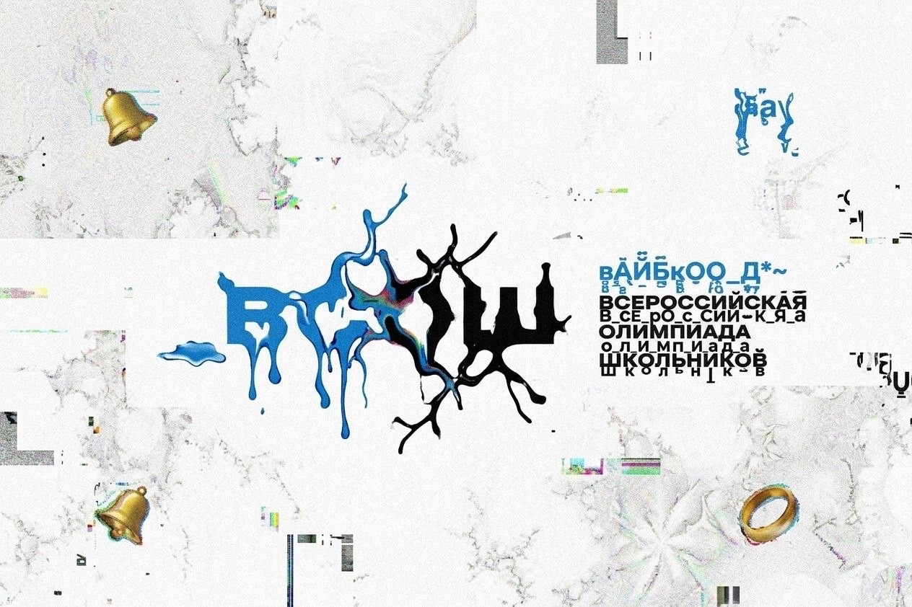

🏆 Всероссийская олимпиада по вайбкодингу — Моя история слива

    «Кровь, пот и deepseek — вот формула моего успеха»

📖 Как я шёл к этому моменту

Всё началось в 4 классе. Обычный школьник, который увидел олимпиаду по вайбкодингу и понял: это моё. С того дня я каждый день ботал по 23 часа. Оставшийся час — на сон и еду.

    Родители сказали: «Ты нас больше не интересуешь».

    Друзья отвернулись — им было не до меня.

    Девушка бросила. На прощание сказала: «Твой код лучше, чем твои чувства».

Но меня это не остановило. Я знал, ради чего всё это:
стать победом на закле.
🤖 Каждое задание — душой ИИ

Ни одного задания не было сделано вручную, кроме 5. Каждый байт, каждая строчка кода рождены в DeepSeek — единственном ИИ, которому я доверил свою мечту.

Все решения пронизаны энергией, потом и слезами, но при этом — чистым гением нейросетей. DeepSeek стал моим вторым «я», моим наставником, моей боевой подругой (после того, как настоящая ушла).
🚀 Что внутри репозитория

    ✅ Решения всех заданий олимпиады по вайбкодинку

    ✅ Код, который заставит плакать даже компилятор

    ✅ Каждый файл — признание в любви DeepSeek

💔 Благодарности

Никому. Я сделал это сам.
Но если хотите — спасибо DeepSeek за то, что не отказался от меня, даже когда отказались все.
🏁 Итог

Я — побед на закле.
Моей целью было не просто участие, а абсолютное доминирование через вайб. И я это сделал.

    «Код пишется не руками, а душой. А моя душа теперь на 100% состоит из deepseek.»

Статус: Абсолютный участник 🏅
Инструмент: DeepSeek
Режим: 23/7 (час на сон — роскошь, но я её себе позволял)